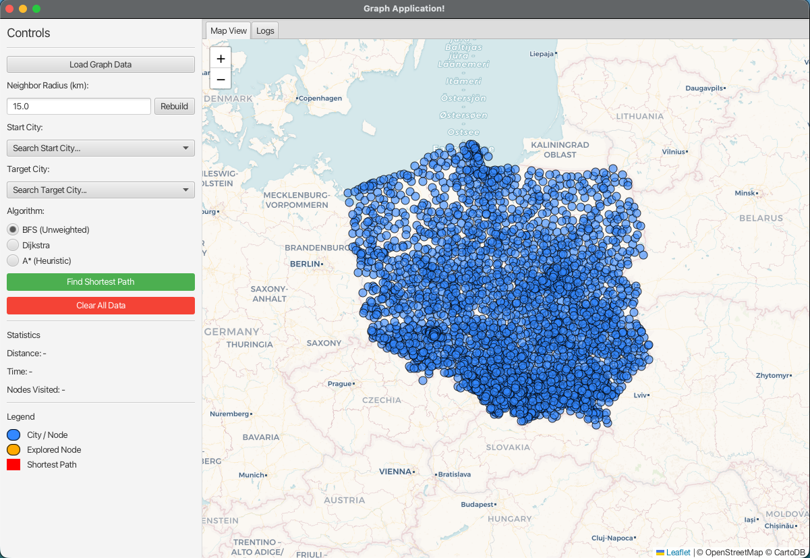
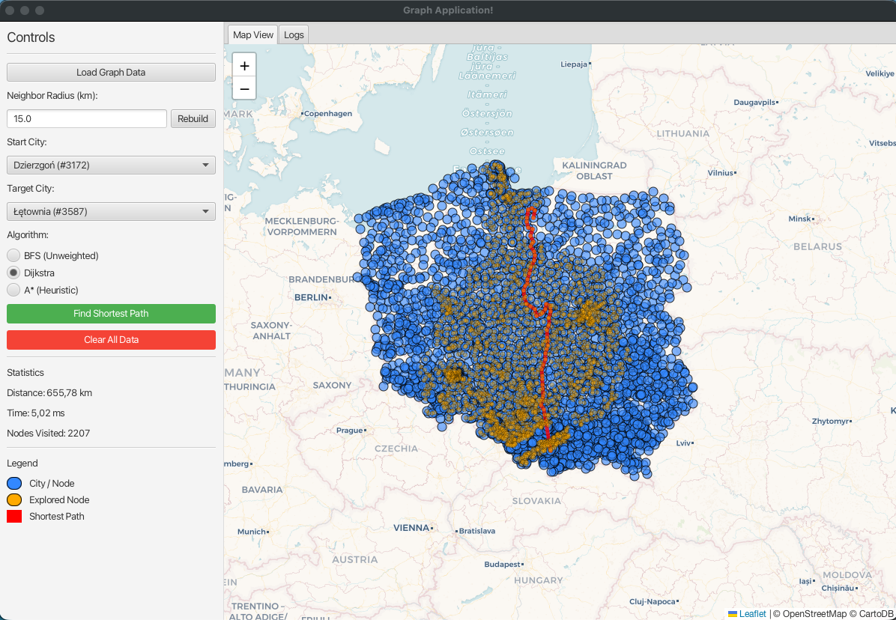

# 🚀 TeamProject-Graph — Pathfinding Visualization (BFS, Dijkstra, A*)

This project implements an advanced pathfinding system for graph-based environments, specifically focused on geographical maps of Poland. It features a modern JavaFX interface integrated with an interactive map visualization (OpenStreetMap via Leaflet.js).

## 🎯 Project Overview
The goal of this project is to find and visualize the shortest paths between cities in Poland using various algorithms. The system allows users to interactively build the graph, set custom edge weights, and analyze the efficiency of different search approaches.

### Supported Algorithms:
- **BFS (Breadth-First Search)**: Finds the path with the minimum number of hops (ideal for unweighted graphs).
- **Dijkstra’s Algorithm**: Finds the shortest path based on actual edge weights (geographic distance or custom weights).
- **A* (A-Star)**: Uses a Euclidean distance heuristic to find the optimal path while exploring significantly fewer nodes.

All algorithms return comprehensive performance statistics via the `PathfindingResult` class.

## 📸 Screenshots
| Main Application Interface | Algorithm Visualization (Dijkstra) |
|:---:|:---:|
|  |  |
| *Modern interface with search and map* | *Real-time pathfinding visualization* |

## ✨ Key Features
- **Interactive Map**: Visualize thousands of cities on an OpenStreetMap. Zoom, pan, and click to select start/target nodes directly from the map.
- **Searchable Selectors**: Quickly find cities using modern Searchable ComboBox components with real-time filtering.
- **Dynamic Graph Rebuilding**: Adjust the **Neighbor Radius** to control how dense the connectivity should be between cities. The graph is built on-the-fly using an efficient grid-based spatial index.
- **Custom Edge Weights**: Override geographic distances between specific cities to simulate traffic, road closures, or different costs.
- **Algorithm Comparison**: View real-time statistics (time in ms, nodes visited, total distance) and see which algorithm performed best for a given route.
- **Path Exploration**: The map visualizes not only the final path but also all the nodes explored by the algorithm (represented as a "fala" for Dijkstra or a targeted search for A*).

## 🧱 Project Structure
- `org.graph.graphproject.BFS/Dijkstra/AStar`: Algorithm implementations.
- `org.graph.graphproject.PathfindingResult`: Data model for search results including path, execution time, cost, and visited nodes count.
- `org.graph.graphproject.Graph`: Adjacency-list representation with optimized grid-based neighbor searching.
- `org.graph.graphproject.Vertex` and `org.graph.graphproject.Edge`: Basic graph structure components.
- `org.graph.graphproject.GraphLoader`: CSV parser for city data with automatic encoding detection.
- `org.graph.graphproject.GraphController`: UI logic and Java-JavaScript bridge.
- `resources/org/graph/graphproject/graph-view.html`: Leaflet-based map visualization.

## 🛠 Prerequisites
- **Java 17+** (JDK 17 or newer).
- **Gradle** (included wrapper can be used).

## ▶️ Build & Run
To run the application:
```bash
./gradlew run
```

## 🧪 Testing
The project includes a comprehensive test suite covering algorithms, graph building, and data loading.
To run tests:
```bash
./gradlew test
```
Test results can be found in `build/reports/tests/test/index.html`.

## 🚀 Continuous Integration & Deployment
This project uses **GitHub Actions** for automated:
- **Testing**: Every push and pull request to the `main` branch triggers the test suite across Windows, Linux, and macOS.
- **Building**: Automatic generation of optimized runtime images using `jlink`.
- **Releases**: Tagged versions (e.g., `v1.0.0`) automatically create a **GitHub Release** with downloadable binaries for all three major operating systems.

## 📂 Data Format
The application expects a CSV file with the following columns:
`CityName, Latitude, Longitude`

Example: `Warszawa, 52.229, 21.012`

**Data Loading Details:**
- **Separators**: Supports both comma (`,`) and semicolon (`;`).
- **Encoding**: Automatically detects **UTF-8** and **Windows-1250** (common for Polish datasets).
- **Custom Data**: While `polandcities.csv` is the default, you can load any compatible dataset (like `engcities.csv`) using the "Load Data" button in the interface.

## 🤝 Team
Project developed as part of a team effort for algorithmic design and implementation.

